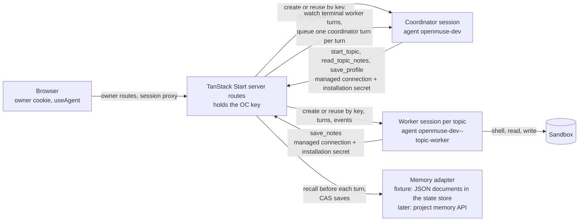

# OpenMuse

A personal assistant you deploy. One conversation with a coordinator that
answers directly or hands work to topics; each topic is a set of notes plus
one ongoing worker session that has a real computer when the task needs one.
Built on OpenComputer Serverless Agents: the platform runs the agent loop,
the isolated sandbox, the brokered credentials and (soon) the notes; this
repository is the experience and the delegation rules.

Working name. The public name is not decided.

## Architecture



- `src/routes/` TanStack Start file routes. `src/routes/api/*` are the
  trusted server routes: they hold the OpenComputer key from the
  environment, authenticate the owner, and are the only thing that talks to
  the platform. `src/routes/_app*` are the screens behind the login;
  [docs/ui.md](docs/ui.md) describes the interface and shows it.
- `src/components/` the interface: shadcn/ui on Tailwind v4, one
  conversation on screen at a time, the browser attached to sessions with
  `@opencomputer/react` (`useAgent`, attach mode) through the app's session
  proxy.
- `opencomputer/` the agent project: `coordinator` and `topic-worker`, deployed
  with the OpenComputer CLI. The worker has the harness shell and filesystem
  (`sandbox_exec` on the Durable Object runtime).
  Both call back into the app through one declared managed connection
  (`tools/app.ts`, generated from `scripts/templates/app-connection.ts` with
  the deployed origin) whose bearer secret OpenComputer attaches; agent code
  never sees it, and the app registers it with the platform for its own
  origin on every owner sign-in (`src/lib/oc/installation.ts`).
- `src/lib/` the services: session lifecycle (`oc/`), owner auth (`auth/`,
  Web Crypto), the memory seam (`memory/`), topics (`topics/`), the
  coordinator conversation (`conversation/`), the interim state store
  (`store/`, `state/`) and the interim return path (`return-path/`). Server
  code uses Web APIs only, so one source builds for Cloudflare Workers and
  for any Node host.
- `src/server.ts` the server entry in the universal fetch-handler shape,
  plus the `scheduled` handler for the Cloudflare cron trigger.

The browser never holds the OpenComputer key. `@opencomputer/react` needs
three routes under the app's own authentication, `GET /api/sessions/:id/events`,
`POST /api/sessions/:id/turns` and `POST /api/sessions/:id/interrupt`
(`src/routes/api/sessions/$id/$action.ts`); the app checks that the session
belongs to this installation, composes the recall projection into each turn
and strips it out of the events it returns. Until `@opencomputer/react`
0.2.0 is on the registry, the dependency is the prebuilt package under
`vendor/` (built from `react/` on branch `feat/project-memory` of
diggerhq/opencomputer); it flips to the registry version when 0.2.0
publishes.

## What is real today and what is a fixture

Real, against the OpenComputer Development environment:

- Owner login and the signed, expiring cookie; CSRF and origin checks on every
  state-changing route; rate-limited login.
- The coordinator session: created once per installation and deployment
  (idempotent by key), replayed from the session events API on every page
  load, new turns polled to the browser from a cursor, Stop.
- Topics: `start_topic` called by the coordinator through the managed
  connection; one worker session per topic, reused for follow-up work; the
  worker clones, runs and verifies in its sandbox; the topic panel shows the
  worker's turns and tool activity live.
- Owner edits to notes conflict with concurrent agent saves and are visible to
  the next worker turn; archive freezes agent writes then ends the worker;
  deliberate worker or coordinator replacement continues from the same notes.

Fixture, each behind one seam so the platform replaces it without touching
the rest:

| Concern | Today | File | When the platform has it |
| --- | --- | --- | --- |
| Memory store (documents, revisions, CAS, freeze) | JSON documents in the state store, seeded from `fixtures/notes/` (bundled at build time) | `src/lib/memory/fixture-store.ts` | `src/lib/memory/platform.ts` (written against the documented routes, untested) is selected with `OPENMUSE_MEMORY=platform` |
| Recall into the agent | The app reads the documents before each turn and carries the projection in the turn input as an `<openmuse-recall>` block; the session proxy strips it from the events the browser reads | `src/lib/memory/recall.ts`, `src/lib/memory/envelope.ts`, `src/routes/api/sessions/$id/$action.ts` | Session `memory` bindings at create; the block and the two agent-side parsers are deleted |
| Agent-side `useMemory()` | `memory/index.ts` in each agent parses the block and returns `{ text, sources, writable }` | `opencomputer/agents/*/memory/index.ts` | `useMemory(profile)` / `useMemory(topics)` |
| Agent saves | `save_notes` and `save_profile` tools call the app; the app supplies the expected revision it last recalled for that session | `opencomputer/agents/*/tools/save-*.ts`, `src/lib/topics/service.ts` | The platform's `memory_save`, `memory_read`, `memory_list`; the tools are deleted |
| Topic index | One JSON document (`state.json`) in the state store: topic ids, worker session ids, invocation and delivery ledgers | `src/lib/state/store.ts` | The `topics` collection is the index; the document keeps only the session map |
| State store | `OPENMUSE_STATE_STORE`: `fs` (files under `OPENMUSE_STATE_DIR`, default `./.openmuse`), `kv` (a Workers KV namespace bound as `OPENMUSE_STORE`), `memory` (lost on restart, warns at start) | `src/lib/store/` | Deleted with the two rows above |
| Return path | One pass (`tick`) reads worker sessions for terminal turn events and queues one coordinator turn per worker turn (idempotent by worker turn id). Drivers: the Cloudflare cron trigger, `POST /api/internal/return-path/tick` from any scheduler, or an in-process timer with `OPENMUSE_RETURN_PATH=timer` | `src/lib/return-path/`, `src/server.ts` | Internal outcome delivery (work 025); the directory is deleted |
| Stop | The platform's `POST /sessions/:id/interrupt` is tried first; while the public edge answers 404 a turn in `interrupt` mode stops the running one (it spends a model turn) | `src/lib/oc/sessions.ts` | The interrupt route |

There is no database. On a host without a persistent disk the `fs` store
does not survive a redeploy; in that case the coordinator session is found
again through its idempotency key, topics are not. That is acceptable for
the fixture phase and goes away with the memory routes. Workers KV is
eventually consistent and last-writer-wins; for a single owner whose
requests land in one location that is acceptable for the same phase.

## Evidence

Runs in OpenComputer Development, project `openmuse-dev`
(`prj_549520fd4be643b1aa6068cbc2610593`), app reached through an HTTPS tunnel
at port 3100, on 2026-09-10 (times UTC). The first three runs were on the
microVM runtime with `anthropic/claude-sonnet-5`; the later ones on the
Durable Object runtime with `anthropic/claude-sonnet-4.6` (see the platform
notes). The transcripts are in the sessions below; the numbers come from
their event logs.

**A real conversation.** Coordinator session `bd75ea2a-71f5-5bd1-851c-cc88090aefa3`.
First turn: "What do you know about me, and what topics are open?" answered
from the recalled profile and the topic overview in 6 s.

**Delegated workshop task.** "Get this workshop demo ready: run it from a
clean checkout, fix anything that fails and give me verified setup
instructions" against `diggerhq/opencomputer-example-quickstart-check`, whose
`docs/quickstart.md` is deliberately broken. The coordinator read the
`workshop-demo` notes, called `start_topic` with the existing topic id, and
acknowledged in one sentence. Worker session `06bd5cc6-bb3f-6cb1-b090-864a1c35a4f9`,
turn `93faf510-dac7-41af-920d-94d1f47054b5`: 19:05:47 to 19:07:51 (2 min 4 s),
24 tool calls, USD 0.64 of model spend. It cloned the repository at
`bd7934d`, followed the guide, reproduced `TypeError: orders.map is not a
function`, applied the one-line fix locally, re-ran the guide and the
repository's own `scripts/verify-quickstart.mjs`, reverted its local edit, and
reported the verified command list with Node 22.23.2 / npm 10.9.8.

**A second concurrent topic.** While the workshop ran: "analyse the
conference budget CSV, totals by category and by payment status". A second
`start_topic` on `conference-budget`; worker session
`954dde35-e9be-0589-b0fa-b60fb2d9996a`, turn `2a305529-c404-4a22-bfdb-7bbd8c867777`:
44 s, 3 tool calls, totals computed with `python3` from the shipped fixture
`fixtures/conference-budget.csv`, one refund flagged and shown both ways.

**Browser closed, outcomes returned.** The browser tab was closed while both
workers ran. Both finished; the return path queued two coordinator turns
(`[topic outcome]` messages, idempotent by worker turn id), and the
coordinator relayed both results in the same conversation. Reopening the
page replayed all of it from the session events.

**Replacement after a redeploy.** Sessions pin their deployment. After the
agents were redeployed the coordinator was replaced from the header
(`bd75ea2a…` ended, successor `c42085da…`, then `e5057323…`) and both workers
from their topic panels; each successor was admitted under a key that names
its predecessor and started from the current notes.

**Follow-up on the same topic, with notes saved.** "Attendees will be on Node
20 LTS, not 22; re-verify and save what you verify." The coordinator read the
topic and called `start_topic` with the same `workshop-demo` id; the worker
session `1b74359a-7483-c8d4-b15d-0ed43f4857d6` (Durable Object runtime, the
sandbox started lazily on its first command in 26 s) cloned the repository,
installed Node 20.20.2 with `n`, reproduced the failure and verified the fix,
and saved the notes through `save_notes` (revision `a4e142a2…`, 1,690 bytes,
writer recorded as that session): 19:18:57 to 19:20:56, 25 tool calls. The
topic summary in the panel changed while the worker ran.

**Owner correction outside chat.** The notes were edited through the notes
route: a save with a stale revision returned `409 conflict`; the save with the
current revision appended an owner correction (Node 20 via nvm, npm only, no
internet after 10:00). The next worker turn (`2a650e26…`, 26 s, no computer
work) restated exactly those three constraints, rewrote the install step to a
pre-downloaded tarball, and saved the reconciled notes. The redesigned notes
panel exercises the same route and the conflict state end to end
([docs/ui.md](docs/ui.md)).

**Stop.** A worker turn running `date -u; sleep 150; date -u` was stopped
after 10 s. The platform recorded `turn.cancelled` and started the Stop turn
at once, but the runtime did not interrupt the command: it ran until the
sandbox's own 120 s command timeout killed it (`SIGKILL, timedOut`), and the
reply arrived 1 min 50 s after Stop. The cancelled turn reached the
coordinator as a `cancelled` outcome. Stop is a turn-record interruption
today, not a runtime cancellation; that is the platform's work 020.

## Platform notes from the build

What the platform made hard, precisely, so they can become bugs or gaps:

- `useSessionData()` has no public write route: the backend has
  `PUT /v1/sessions/:id/data`, the api-edge does not expose it. Recall
  therefore travels inside the turn input until memory bindings exist.
- New deployments started landing on the Durable Object runtime
  (`workerd-lazy-sandbox`) during the build; the first deployment had been a
  microVM. On that runtime `useModel` with anything but
  `anthropic/claude-sonnet-4.6` fails every turn, the harness `shell`, `read`,
  `glob` and `grep` tools fail with a `path ... Received 'undefined'` error,
  and the sandbox is reachable only through the host-added `sandbox_exec`
  tool. The worker registers both; the microVM evidence above used `shell`.
- `turn.failed` carries a generic message through the API and the dashboard;
  the real reason (`This Workerd slice cannot yet switch to ...`) was found by
  reading the runtime source.
- Session create with a reused `Idempotency-Key` returns `409` after a
  redeploy because the resolved deployment id differs; the keys here include
  the deployment id, so a redeploy admits a new session on purpose.
- There is no bare interrupt route; Stop is a turn in `interrupt` mode, which
  spends a model turn, and the runtime does not cancel the running command.
- Tool events differ between runtimes (`{ tool, input, output }` on the
  microVM, `{ id, input, content }` plus the name on `tool.progress` on the
  Durable Object); the reducer handles both.
- Tool call ids are not on `ToolExecutionContext`; `start_topic` derives its
  invocation id from the session id, message id and arguments, so two
  identical calls in one message converge on one admitted turn.
- The public event log needs polling (`/events?after=`); `@opencomputer/react`
  polls it from a cursor through the app's session proxy.
- `POST /sessions/:id/interrupt` is not on the public edge yet (`404 route
  not found` on 2026-09-10); the app falls back to the interrupt-mode turn.
- `fetch(..., { redirect: "error" })` is not implemented in workerd; the
  client uses `manual` and refuses any redirect itself.

## Deploy

[](https://deploy.workers.cloudflare.com/?url=https://github.com/diggerhq/openmuse)
[](https://render.com/deploy?repo=https://github.com/diggerhq/openmuse)
[](https://cloud.digitalocean.com/apps/new?repo=https://github.com/diggerhq/openmuse/tree/main)

| Host | Status | What you enter | Doc |
| --- | --- | --- | --- |
| Cloudflare Workers | **verified** (CLI path, 2026-09-10); the button is configured but not exercised: it needs a public repository | API key, project id, the three OpenMuse secrets from `.env.local` | [docs/deploy/cloudflare.md](docs/deploy/cloudflare.md) |
| Docker image `ghcr.io/diggerhq/openmuse` | **verified** locally (2026-09-10); published by CI on `main` and `v*` tags | `--env-file .env.local`, a volume at `/data`, an https origin in front | [docs/deploy/docker.md](docs/deploy/docker.md) |
| Fly.io | **verified** (2026-09-10); CLI only, Fly has no deploy button | `fly secrets import < .env.local` | [docs/deploy/fly.md](docs/deploy/fly.md) |
| Render | spec validated, deploy not exercised; the button works with a private repository once Render's GitHub App is installed on it | API key and project id only; Render generates the three OpenMuse secrets | [docs/deploy/render.md](docs/deploy/render.md) |
| Railway | spec validated (`.railway/railway.ts`, the current IaC format; `railway.json` is deprecated), deploy not exercised; no button, Railway buttons come from dashboard-authored templates | five values with `railway variables --set` | [docs/deploy/railway.md](docs/deploy/railway.md) |
| DigitalOcean App Platform | spec validated, deploy not exercised; the button needs a public repository | API key, project id, the three OpenMuse secrets | [docs/deploy/digitalocean.md](docs/deploy/digitalocean.md) |
| Vercel, Netlify | **unsupported** for now, see below | | |

Every path starts the same way and ends the same way:

```sh
git clone https://github.com/diggerhq/openmuse.git && cd openmuse && npm ci
npx opencomputer login
npm run setup -- --target <cloudflare|docker|railway|render|fly|digitalocean>
#   generates the OpenMuse secrets into .env.local (mode 600), copies the OpenComputer
#   key from the CLI login, links or creates the project openmuse-dev, prints the steps
... deploy the app on the host (button or CLI, per the doc) ...
npm run setup -- --origin https://<the app's host>
#   deploys both agents to Development with their managed connection pinned to that origin
```

Then open the app and sign in with `OPENMUSE_OWNER_SECRET` (from `.env.local`,
or from the host's dashboard where the host generated it). The sign-in
registers the installation secret `OPENMUSE_AGENT_SECRET` with the platform
for that origin (`src/lib/oc/installation.ts`), so nothing else is uploaded
by hand. One installation is live per project: the last sign-in owns the
secret, and its origin must be the one the agents were deployed with. Lost
the owner secret: `npm run setup -- --rotate`, put the new values on the
host, redeploy; every existing login stops working.

The interim limitation, once: until memory documents carry topics, the topic
index lives in Workers KV (Cloudflare), a volume (`OPENMUSE_STATE_DIR`:
Docker, Fly, Render, Railway) or in-process memory (DigitalOcean, lost on
restart); and until platform delivery lands, the return path runs on the
Cloudflare cron trigger or an in-process timer (`OPENMUSE_RETURN_PATH=timer`,
which the Docker image sets). Both directories are deleted when the platform
has them.

**Vercel and Netlify are not supported yet.** TanStack Start documents both
(Vercel through Nitro, Netlify through `@netlify/vite-plugin-tanstack-start`),
and the app's server code is Web-API only, so the SSR and the session proxy
would likely build. What is missing is the rest of the interim scaffolding:
neither host has a persistent disk or a KV binding the state store speaks
(a Netlify Blobs or Redis driver would have to be written), the return path
would need a scheduled function or Vercel cron adapter (Vercel cron calls a
GET path; the tick is a `POST` with a bearer token) and the app's custom
server entry with the `scheduled` handler has not been tried under either
plugin. Rather than a button that deploys an app whose topics vanish on
every cold start, they wait for the platform's memory and delivery routes,
after which the app needs neither a store nor a scheduler.

The same source builds for every host: `OPENMUSE_TARGET=cloudflare` selects
the Cloudflare adapter at build time; the default build is served by srvx
on any Node host (`npm run build && npm start`, listens on `PORT`).

## Environment variables

All configuration comes from the environment; `.env.example` lists every
variable with one line each. Required: `OPENCOMPUTER_API_KEY`,
`OPENCOMPUTER_PROJECT_ID`, `OPENMUSE_OWNER_SECRET`, `OPENMUSE_COOKIE_SECRET`,
`OPENMUSE_AGENT_SECRET`. Everything else has a default.

| Name | Purpose |
| --- | --- |
| `OPENCOMPUTER_API_KEY` | The OpenComputer key, server only |
| `OPENCOMPUTER_PROJECT_ID` | The linked project |
| `OPENCOMPUTER_ENVIRONMENT` | `development` (default) or `production` |
| `OPENCOMPUTER_API_URL` | Default `https://app.opencomputer.dev` |
| `OPENMUSE_OWNER_SECRET` | What the owner types into the login form |
| `OPENMUSE_COOKIE_SECRET` | Signs the session cookie |
| `OPENMUSE_AGENT_SECRET` | The installation secret the agents present to `/api/agent/*`; the app registers it as the project secret, allowed for its origin, on every owner sign-in |
| `OPENMUSE_APP_ORIGIN` | The app's public HTTPS origin; default: the origin of each request |
| `OPENMUSE_INSTALLATION_ID` | Part of every session idempotency key; default `default` |
| `OPENMUSE_COORDINATOR_AGENT`, `OPENMUSE_WORKER_AGENT` | Cloud agent ids; default `openmuse-dev`, `openmuse-dev--topic-worker` |
| `OPENMUSE_STATE_STORE` | `fs` (default), `kv` (Cloudflare), `memory` |
| `OPENMUSE_STATE_DIR` | For `fs`: default `./.openmuse` (the Docker image sets `/data`) |
| `OPENMUSE_MEMORY` | `fixture` (default) or `platform` |
| `OPENMUSE_RETURN_PATH` | `timer` runs the interim return path in-process |
| `OPENMUSE_ALLOW_INSECURE_COOKIES` | `1` drops the `Secure` cookie attribute for plain-http localhost |
| `PORT` | For `npm start`; default 3000 |

## Run locally

```sh
npm run setup -- --origin https://<tunnel host>   # once
ngrok http --domain=<tunnel host> 3100            # or any HTTPS tunnel to 3100
npm run dev                                       # http://localhost:3100, open the tunnel URL
```

`npm run dev` runs the server in Node with the `fs` store;
`npm run dev:cloudflare` runs it in workerd with a local KV namespace, the
way it runs on Cloudflare. Sign in with the owner secret from `.env.local`;
the sign-in registers the installation secret for the tunnel origin (the
last sign-in wins, so signing in here moves it away from a deployed host
until you sign in there again).

`npm run check` runs the typecheck, Biome, the unit tests (Vitest) and the
agent doctor; `npm run test:e2e` runs the Playwright suite against whatever
listens on port 3100 (`BASE_URL` overrides it) and refreshes the screenshots
in `docs/screenshots/`; it sends a handful of short turns to the real
coordinator. `npm run deploy:agents` redeploys the agents. Sessions pin the
deployment they started on, so after a redeploy start a new computer from a
topic's Work panel; the successor starts from the current notes.

## Owner access

The first version uses a generated login secret, not accounts. The login
form posts it to `/api/auth/login`, which compares in constant time, limits
failures to five per client per fifteen minutes, and sets an `HttpOnly`,
`Secure`, `SameSite=Lax` cookie signed with `OPENMUSE_COOKIE_SECRET` that
expires after seven days. Every state-changing route checks the request
origin and a CSRF token bound to the cookie. Secrets never appear in URLs or
browser storage. The OpenComputer key and the agents' installation secret are
separate credentials from the owner's.
