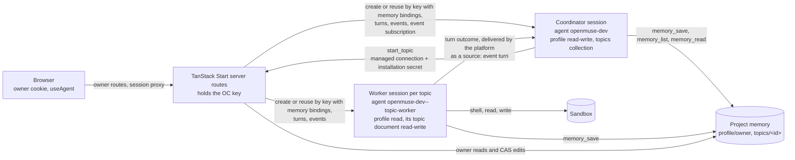

# OpenMuse

A personal assistant you deploy. One conversation with a coordinator that
answers directly or hands work to topics; each topic is a set of notes plus
one ongoing worker session that has a real computer when the task needs one.
Built on OpenComputer Serverless Agents: the platform runs the agent loop,
the isolated sandbox, the brokered credentials and the notes (project
memory); this repository is the experience and the delegation rules.

Working name. The public name is not decided.

## Architecture



- `src/routes/` TanStack Start file routes. `src/routes/api/*` are the
  trusted server routes: they hold the OpenComputer key from the
  environment, authenticate the owner, and are the only thing that talks to
  the platform. `src/routes/_app*` are the screens behind the login;
  [docs/ui.md](docs/ui.md) describes the interface and shows it.
- `src/components/` the interface: shadcn/ui on Tailwind v4, one
  conversation on screen at a time, the browser attached to sessions with
  `@opencomputer/react` (`useAgent`, attach mode) through the app's session
  proxy.
- `opencomputer/` the agent project: `coordinator` and `topic-worker`, deployed
  with the OpenComputer CLI. Both declare the two memory resources
  (`scripts/templates/memory.ts`, copied into each agent by
  `prepare-agent`): `profile`, one document for the owner, and `topics`,
  one document per topic. The coordinator reads both through `useMemory`
  and saves the profile with the platform's `memory_save`; the worker reads
  the profile and its topic document, saves with `memory_save`, and has the
  harness shell and filesystem (`sandbox_exec` on the Durable Object
  runtime). The coordinator calls back into the app through one declared
  managed connection (`tools/app.ts`, generated from
  `scripts/templates/app-connection.ts` with the deployed origin) for the
  one app tool, `start_topic`; the connection's bearer secret is attached by
  OpenComputer, agent code never sees it, and the app registers it with the
  platform for its own origin on every owner sign-in
  (`src/lib/oc/installation.ts`).
- `src/lib/` the services: project memory over the management API
  (`memory/`), session lifecycle with memory bindings (`oc/`), owner auth
  (`auth/`, Web Crypto), topics (`topics/`), the coordinator conversation and
  its outcome subscription (`conversation/`), the session map (`store/`,
  `state/`) and the fallback return path (`return-path/`, until the
  platform's event subscriptions are on production). Server code uses Web
  APIs only, so one source builds for Cloudflare Workers and for any Node
  host.
- `src/server.ts` the server entry in the universal fetch-handler shape,
  plus the `scheduled` handler for the Cloudflare cron trigger of the
  fallback return path.

The browser never holds the OpenComputer key. `@opencomputer/react` needs
three routes under the app's own authentication, `GET /api/sessions/:id/events`,
`POST /api/sessions/:id/turns` and `POST /api/sessions/:id/interrupt`
(`src/routes/api/sessions/$id/$action.ts`); the app checks that the session
belongs to this installation and forwards the rest.

## What runs where

Everything below runs against the OpenComputer Development environment of
the linked project; there is no fixture mode and no database.

| Concern | How | Where |
| --- | --- | --- |
| Notes | Project memory: `profile/owner` and one `topics/<id>` document per topic, per project and environment. The app reads and edits them through the management API with compare-and-swap on the revision; agents read them through their session bindings and save with `memory_save`. `npm run seed` puts the demo notes from `fixtures/notes/` in place where they do not exist. | `src/lib/memory/index.ts`, `scripts/seed-notes.mjs` |
| Recall into the agent | Session `memory` bindings, fixed at creation: the coordinator binds the profile read-write and the topics collection read; a worker binds the profile read and its topic document read-write. The platform resolves the projections before every render; `useMemory` returns `{ text, sources, writable }`. | `src/lib/conversation/service.ts`, `src/lib/topics/service.ts`, `opencomputer/agents/*/agent.ts` |
| Agent saves | The platform's `memory_save` (and `memory_list`, `memory_read` on the collection), offered by the binding; the host holds the revision the render saw, so a stale save conflicts. | the platform |
| Topic index | The `topics` collection is the index. The app keeps only the session map: which coordinator session is live, its outcome subscription, and which worker session each topic has (and had). | `src/lib/state/store.ts` |
| Session map store | `OPENMUSE_STATE_STORE`: `fs` (files under `OPENMUSE_STATE_DIR`, default `./.openmuse`), `kv` (a Workers KV namespace bound as `OPENMUSE_STORE`), `memory` (lost on restart: the coordinator session is found again by its key, topics keep their notes and get a fresh worker on the next task) | `src/lib/store/` |
| Archive | The document's `agentWrites` policy: archive disables agent writes, then ends the worker; unarchive re-enables them, the next task starts a fresh worker on the same notes. Freezing a document with the OpenComputer CLI is the same state. | `src/lib/topics/service.ts` |
| Return path | An event subscription per coordinator session: the platform delivers every worker turn outcome (`turn.completed`, `turn.failed`, `turn.cancelled`) to it as a turn with `source: "event"` input. **Pending on production** (blue #64): the create answers 404 today, the app retries once a minute, and the fallback pass (in-process timer on Node, cron trigger on Cloudflare) queues one coordinator turn per worker turn with the same text the platform records, idempotent by worker turn id. The fallback stands down once the subscription exists. | `src/lib/conversation/service.ts`, `src/lib/return-path/` |
| Stop | The platform's `POST /sessions/:id/interrupt` is tried first; while it answers 404 (also blue #64) a turn in `interrupt` mode stops the running one (it spends a model turn) | `src/lib/oc/sessions.ts` |

Sessions pin the deployment they were created on. An installation upgraded
to this version replaces its coordinator (owner menu) and each topic's
worker (Work panel); the successors are created with memory bindings and
start from the current notes.

Dependencies: `@opencomputer/agent` 0.6.0, `@opencomputer/cli` 0.7.1,
`@opencomputer/sdk` 1.1.1 (types only: the memory and event-subscription
shapes) and `@opencomputer/react` 0.2.0 from npm.

## Evidence

Runs in OpenComputer Development, project `openmuse-dev`
(`prj_549520fd4be643b1aa6068cbc2610593`), app reached through an HTTPS tunnel
at port 3100 (times UTC). The transcripts are in the sessions named below;
the numbers come from their event logs.

### Project memory, 2026-09-11

Both agents deployed with the `profile` (4,096 bytes) and `topics` (8,192
bytes) declarations; `GET /projects/<id>/memory?environment=development`
lists both as declared. `npm run seed` created `profile/owner`,
`topics/workshop-demo` and `topics/conference-budget` (revision `1`,
`writer: owner`).

**Coordinator bound to memory.** Session `f86ac3c4-8455-a297-e86e-75c7395df196`
created with `{ profile: document owner read-write, topics: collection read }`;
inspection lists the bindings with `writable`. First turn, "what do you know
about me, which topics are open, and remember that I prefer British
English": answered from the profile text and the collection overview, and
`memory_save` committed profile revision `2` (217 bytes, `writer: agent`
with that session id); the `memory.saved` event followed at once.

**Coordinator reads a topic, delegates.** Session `7c82857f-c878-9d0a-0162-e0200be93ce8`,
turn `7c2f185c-5530-408f-980c-8c43e7122aca`: `memory_read({ id:
"conference-budget" })` on the collection, then `start_topic` through the
tunnel (`201`, 3.8 s), which created worker session
`090318da-6124-58ad-61f6-1ea8326ae5e5` bound to `topics/conference-budget`
read-write and `profile/owner` read.

**Worker saves through its binding.** That worker's turn
`4ea9d68f-244f-4b71-a386-15f60046adeb` (00:04:46 to 00:05:41): the harness
`read` and `glob` failed on the Durable Object runtime, `sandbox_exec` found
and read the CSV and ran `python3`; `memory_save` committed revision `3`
(802 bytes, totals by category and status). It also saved an 11-byte
placeholder as revision `2` on its first step; the worker prompt now says a
save replaces the whole document.

**Outcome back in the conversation.** With event subscriptions still
answering 404 on production, the fallback pass delivered that turn's outcome
to the replacement coordinator `ec1673d5-bc90-7ef5-3c97-65847dc65959` as the
platform's outcome text (turn `6`, 00:13:26); the coordinator parsed it and
relayed the totals under the topic title. The end-to-end suite ran as its
own installation (`e2e`, coordinator `327c3012-7a81-da6e-f981-9d974eca708a`,
worker `5fa9acc2-c231-5d0e-4337-961567d7acc6`): 14 passed, including an
owner edit that conflicts on a stale revision and a worker turn that ran
`node --version` in its sandbox.

### Before project memory, 2026-09-10

These runs used the fixture memory (JSON documents in the state store,
recalled into each turn's input) and the interim return path; the platform
parts are unchanged. The first three runs were on the microVM runtime with
`anthropic/claude-sonnet-5`; the later ones on the Durable Object runtime
with `anthropic/claude-sonnet-4.6` (see the platform notes).

**A real conversation.** Coordinator session `bd75ea2a-71f5-5bd1-851c-cc88090aefa3`.
First turn: "What do you know about me, and what topics are open?" answered
from the recalled profile and the topic overview in 6 s.

**Delegated workshop task.** "Get this workshop demo ready: run it from a
clean checkout, fix anything that fails and give me verified setup
instructions" against `diggerhq/opencomputer-example-quickstart-check`, whose
`docs/quickstart.md` is deliberately broken. The coordinator read the
`workshop-demo` notes, called `start_topic` with the existing topic id, and
acknowledged in one sentence. Worker session `06bd5cc6-bb3f-6cb1-b090-864a1c35a4f9`,
turn `93faf510-dac7-41af-920d-94d1f47054b5`: 19:05:47 to 19:07:51 (2 min 4 s),
24 tool calls, USD 0.64 of model spend. It cloned the repository at
`bd7934d`, followed the guide, reproduced `TypeError: orders.map is not a
function`, applied the one-line fix locally, re-ran the guide and the
repository's own `scripts/verify-quickstart.mjs`, reverted its local edit, and
reported the verified command list with Node 22.23.2 / npm 10.9.8.

**A second concurrent topic.** While the workshop ran: "analyse the
conference budget CSV, totals by category and by payment status". A second
`start_topic` on `conference-budget`; worker session
`954dde35-e9be-0589-b0fa-b60fb2d9996a`, turn `2a305529-c404-4a22-bfdb-7bbd8c867777`:
44 s, 3 tool calls, totals computed with `python3` from the shipped fixture
`fixtures/conference-budget.csv`, one refund flagged and shown both ways.

**Browser closed, outcomes returned.** The browser tab was closed while both
workers ran. Both finished; the return path queued two coordinator turns
(`[topic outcome]` messages, idempotent by worker turn id), and the
coordinator relayed both results in the same conversation. Reopening the
page replayed all of it from the session events.

**Replacement after a redeploy.** Sessions pin their deployment. After the
agents were redeployed the coordinator was replaced from the header
(`bd75ea2a…` ended, successor `c42085da…`, then `e5057323…`) and both workers
from their topic panels; each successor was admitted under a key that names
its predecessor and started from the current notes.

**Follow-up on the same topic, with notes saved.** "Attendees will be on Node
20 LTS, not 22; re-verify and save what you verify." The coordinator read the
topic and called `start_topic` with the same `workshop-demo` id; the worker
session `1b74359a-7483-c8d4-b15d-0ed43f4857d6` (Durable Object runtime, the
sandbox started lazily on its first command in 26 s) cloned the repository,
installed Node 20.20.2 with `n`, reproduced the failure and verified the fix,
and saved the notes through `save_notes` (revision `a4e142a2…`, 1,690 bytes,
writer recorded as that session): 19:18:57 to 19:20:56, 25 tool calls. The
topic summary in the panel changed while the worker ran.

**Owner correction outside chat.** The notes were edited through the notes
route: a save with a stale revision returned `409 conflict`; the save with the
current revision appended an owner correction (Node 20 via nvm, npm only, no
internet after 10:00). The next worker turn (`2a650e26…`, 26 s, no computer
work) restated exactly those three constraints, rewrote the install step to a
pre-downloaded tarball, and saved the reconciled notes. The redesigned notes
panel exercises the same route and the conflict state end to end
([docs/ui.md](docs/ui.md)).

**Stop.** A worker turn running `date -u; sleep 150; date -u` was stopped
after 10 s. The platform recorded `turn.cancelled` and started the Stop turn
at once, but the runtime did not interrupt the command: it ran until the
sandbox's own 120 s command timeout killed it (`SIGKILL, timedOut`), and the
reply arrived 1 min 50 s after Stop. The cancelled turn reached the
coordinator as a `cancelled` outcome. Stop is a turn-record interruption
today, not a runtime cancellation; that is the platform's work 020.

## Platform notes from the build

What the platform made hard, precisely, so they can become bugs or gaps:

- Event subscriptions and `POST /sessions/:id/interrupt` are on the public
  edge but answer `404 not_found` from the backend (2026-09-11); the
  delivery half (blue #64) is not deployed. The app keeps the fallback pass
  and the interrupt-mode Stop until it is.
- `toolCallId` is typed on `ToolExecutionContext` but the deployed sandbox
  runtime does not pass it into a code tool's `run` (`messageId` arrives);
  `start_topic` keys its invocation on the tool call id when present and on
  the message id and arguments otherwise.
- The management API's session inspection includes two undocumented
  internal fields, `memoryObject` (the Memory Durable Object name, which
  contains the account id) and `memoryAdmission`.
- Subscriptions select by agent, not by session, so two installations in one
  project and environment would deliver each other's worker outcomes. One
  installation per project and environment is already the rule for the
  installation secret; the test installation deletes its subscription when
  the suite ends.
- `@opencomputer/sdk` has `startSessionOnDocument` (document create if
  absent, then the bound session), but importing the package swaps Node's
  global fetch dispatcher and pre-warms 48 connections at import time, and
  its exports map offers no side-effect-free path to the helper; the app
  uses the SDK for types only and does the two calls itself.
- New deployments land on the Durable Object runtime. On it `useModel` with
  anything but `anthropic/claude-sonnet-4.6` fails every turn, the harness
  `shell`, `read`, `glob` and `grep` tools fail with a `path ... Received
  'undefined'` error, and the sandbox is reachable only through the
  host-added `sandbox_exec` tool. The worker registers both.
- Session create with a reused `Idempotency-Key` returns `409` after a
  redeploy because the resolved deployment id differs; the keys here include
  the deployment id, so a redeploy admits a new session on purpose. The same
  key with different memory bindings is also a `409`.
- Tool events differ between runtimes (`{ tool, input, output }` on the
  microVM, `{ id, input, content }` plus the name on `tool.progress` on the
  Durable Object); the reducer handles both.
- The public event log needs polling (`/events?after=`); `@opencomputer/react`
  polls it from a cursor through the app's session proxy.
- `fetch(..., { redirect: "error" })` is not implemented in workerd; the
  client uses `manual` and refuses any redirect itself.

## Deploy

[](https://deploy.workers.cloudflare.com/?url=https://github.com/diggerhq/openmuse)
[](https://render.com/deploy?repo=https://github.com/diggerhq/openmuse)
[](https://cloud.digitalocean.com/apps/new?repo=https://github.com/diggerhq/openmuse/tree/main)

| Host | Status | What you enter | Doc |
| --- | --- | --- | --- |
| Cloudflare Workers | **verified** (CLI path, 2026-09-10); the button is configured but not exercised: it needs a public repository | API key, project id, the three OpenMuse secrets from `.env.local` | [docs/deploy/cloudflare.md](docs/deploy/cloudflare.md) |
| Docker image `ghcr.io/diggerhq/openmuse` | **verified** locally (2026-09-10); published by CI on `main` and `v*` tags | `--env-file .env.local`, a volume at `/data`, an https origin in front | [docs/deploy/docker.md](docs/deploy/docker.md) |
| Fly.io | **verified** (2026-09-10); CLI only, Fly has no deploy button | `fly secrets import < .env.local` | [docs/deploy/fly.md](docs/deploy/fly.md) |
| Render | spec validated, deploy not exercised; the button works with a private repository once Render's GitHub App is installed on it | API key and project id only; Render generates the three OpenMuse secrets | [docs/deploy/render.md](docs/deploy/render.md) |
| Railway | spec validated (`.railway/railway.ts`, the current IaC format; `railway.json` is deprecated), deploy not exercised; no button, Railway buttons come from dashboard-authored templates | five values with `railway variables --set` | [docs/deploy/railway.md](docs/deploy/railway.md) |
| DigitalOcean App Platform | spec validated, deploy not exercised; the button needs a public repository | API key, project id, the three OpenMuse secrets | [docs/deploy/digitalocean.md](docs/deploy/digitalocean.md) |
| Vercel, Netlify | **unsupported** for now, see below | | |

Every path starts the same way and ends the same way:

```sh
git clone https://github.com/diggerhq/openmuse.git && cd openmuse && npm ci
npx opencomputer login
npm run setup -- --target <cloudflare|docker|railway|render|fly|digitalocean>
#   generates the OpenMuse secrets into .env.local (mode 600), copies the OpenComputer
#   key from the CLI login, links or creates the project openmuse-dev, prints the steps
... deploy the app on the host (button or CLI, per the doc) ...
npm run setup -- --origin https://<the app's host>
#   deploys both agents to Development with their managed connection pinned to that origin
```

Then open the app and sign in with `OPENMUSE_OWNER_SECRET` (from `.env.local`,
or from the host's dashboard where the host generated it). The sign-in
registers the installation secret `OPENMUSE_AGENT_SECRET` with the platform
for that origin (`src/lib/oc/installation.ts`), so nothing else is uploaded
by hand. One installation is live per project: the last sign-in owns the
secret, and its origin must be the one the agents were deployed with. Lost
the owner secret: `npm run setup -- --rotate`, put the new values on the
host, redeploy; every existing login stops working.

What each host keeps: the session map, in Workers KV (Cloudflare), on a
volume (`OPENMUSE_STATE_DIR`: Docker, Fly, Render, Railway) or in process
memory (DigitalOcean, lost on restart). Notes are project memory on
OpenComputer on every host. Until the platform's event subscriptions are on
production the fallback return path runs on the Cloudflare cron trigger or
the in-process timer on Node; nothing has to be configured for it.

**Vercel and Netlify are not supported yet.** TanStack Start documents both
(Vercel through Nitro, Netlify through `@netlify/vite-plugin-tanstack-start`),
and the app's server code is Web-API only, so the SSR and the session proxy
would likely build. What is missing: neither host has a persistent disk or
a KV binding the session map speaks (a Netlify Blobs or Redis driver would
have to be written), the fallback return path would need a scheduled
function, and the app's custom server entry has not been tried under either
plugin. They wait for the platform's delivery routes, after which the app
needs no scheduler, and for a session-map driver.

The same source builds for every host: `OPENMUSE_TARGET=cloudflare` selects
the Cloudflare adapter at build time; the default build is served by srvx
on any Node host (`npm run build && npm start`, listens on `PORT`).

## Environment variables

All configuration comes from the environment; `.env.example` lists every
variable with one line each. Required: `OPENCOMPUTER_API_KEY`,
`OPENCOMPUTER_PROJECT_ID`, `OPENMUSE_OWNER_SECRET`, `OPENMUSE_COOKIE_SECRET`,
`OPENMUSE_AGENT_SECRET`. Everything else has a default.

| Name | Purpose |
| --- | --- |
| `OPENCOMPUTER_API_KEY` | The OpenComputer key, server only |
| `OPENCOMPUTER_PROJECT_ID` | The linked project |
| `OPENCOMPUTER_ENVIRONMENT` | `development` (default) or `production` |
| `OPENCOMPUTER_API_URL` | Default `https://app.opencomputer.dev` |
| `OPENMUSE_OWNER_SECRET` | What the owner types into the login form |
| `OPENMUSE_COOKIE_SECRET` | Signs the session cookie |
| `OPENMUSE_AGENT_SECRET` | The installation secret the agents present to `/api/agent/*`; the app registers it as the project secret, allowed for its origin, on every owner sign-in |
| `OPENMUSE_APP_ORIGIN` | The app's public HTTPS origin; default: the origin of each request |
| `OPENMUSE_INSTALLATION_ID` | Part of every session idempotency key (one installation per project and environment); default `default` |
| `OPENMUSE_COORDINATOR_AGENT`, `OPENMUSE_WORKER_AGENT` | Cloud agent ids; default `openmuse-dev`, `openmuse-dev--topic-worker` |
| `OPENMUSE_STATE_STORE` | The session map: `fs` (default), `kv` (Cloudflare), `memory` |
| `OPENMUSE_STATE_DIR` | For `fs`: default `./.openmuse` (the Docker image sets `/data`) |
| `OPENMUSE_ALLOW_INSECURE_COOKIES` | `1` drops the `Secure` cookie attribute for plain-http localhost |
| `PORT` | For `npm start`; default 3000 |

## Run locally

```sh
npm run setup -- --origin https://<tunnel host>   # once
ngrok http --domain=<tunnel host> 3100            # or any HTTPS tunnel to 3100
npm run dev                                       # http://localhost:3100, open the tunnel URL
```

`npm run dev` runs the server in Node with the `fs` store (the dev server
accepts the `OPENMUSE_APP_ORIGIN` host, so the agents reach it through the
tunnel); `npm run dev:cloudflare` runs it in workerd with a local KV
namespace, the way it runs on Cloudflare. Sign in with the owner secret from
`.env.local`; the sign-in registers the installation secret for the tunnel
origin (the last sign-in wins, so signing in here moves it away from a
deployed host until you sign in there again). `npm run seed` puts the demo
notes into project memory where they do not exist yet; `npx opencomputer
memory list topics` and `memory show topics workshop-demo` read them outside
the app.

The dev server holds port 3100 and refuses to move (`--strictPort`): a
second `npm run dev` fails instead of silently taking the next port with
the same installation. `GET /api/health` names the installation a server
runs as.

While the dev server runs it writes `.openmuse/transcript.jsonl` (the state
directory, gitignored): one JSON line per owner message, coordinator or
worker reply, topic start, worker outcome and Stop, with timestamps and the
session and turn ids, plus the `turn.*`, `memory.saved` and `session.failed`
events the browser received. It is what the owner saw, for debugging a
conversation against the sessions in the OpenComputer dashboard. Only the
Vite dev server writes it (`import.meta.env.MODE === "development"`, with
the `fs` store); production builds compile the code path out.

`npm run check` runs the typecheck, Biome, the unit tests (Vitest) and the
agent doctor. `npm run test:e2e` runs the Playwright suite against the real
Development environment as its own installation: it starts its own server
on port 3101 with installation id `e2e` and state under `.openmuse-e2e/`,
so its coordinator and worker sessions are separate from yours (notes are
shared: the suite restores what it edits), and it deletes that
installation's outcome subscription when it ends. Before any test runs it
checks that the server it targets reports installation `e2e` on
`/api/health` and aborts otherwise; it never reuses a server it finds on
its port, and `BASE_URL` may point it at another server only if that one
passes the same check. It sends a handful of short coordinator turns and
one worker turn that uses the sandbox. `SCREENSHOT_DIR=docs/screenshots`
refreshes the screenshots in [docs/ui.md](docs/ui.md). `npm run
deploy:agents` redeploys the agents. Sessions pin the deployment they
started on, so after a redeploy replace the coordinator from the owner menu
and start a new computer from a topic's Work panel; the successors start
from the current notes.

## Owner access

The first version uses a generated login secret, not accounts. The login
form posts it to `/api/auth/login`, which compares in constant time, limits
failures to five per client per fifteen minutes, and sets an `HttpOnly`,
`Secure`, `SameSite=Lax` cookie signed with `OPENMUSE_COOKIE_SECRET` that
expires after seven days. Every state-changing route checks the request
origin and a CSRF token bound to the cookie. Secrets never appear in URLs or
browser storage. The OpenComputer key and the agents' installation secret are
separate credentials from the owner's.
