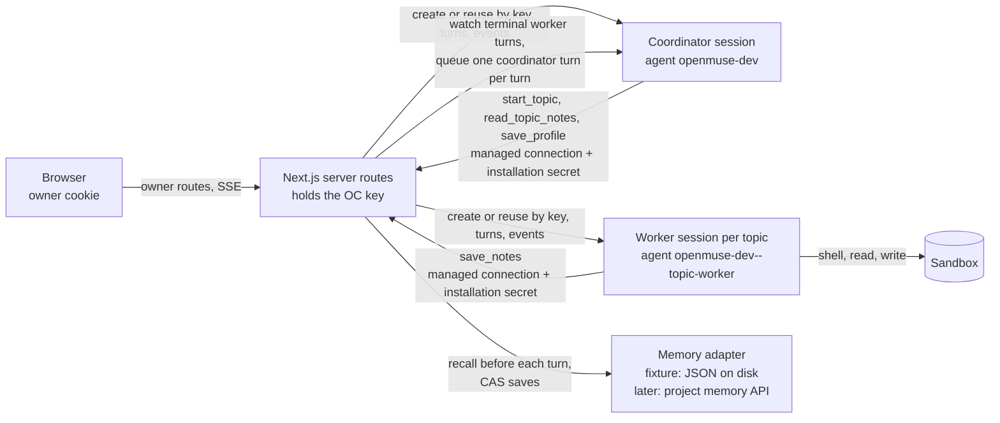

# OpenMuse

A personal assistant you deploy. One conversation with a coordinator that
answers directly or hands work to topics; each topic is a set of notes plus
one ongoing worker session that has a real computer when the task needs one.
Built on OpenComputer Serverless Agents: the platform runs the agent loop,
the isolated sandbox, the brokered credentials and (soon) the notes; this
repository is the experience and the delegation rules.

Working name. The public name is not decided.

## Architecture



- `app/` Next.js App Router. `app/api/*` are the trusted routes: they hold
  the OpenComputer key from the environment, authenticate the owner, and are
  the only thing that talks to the platform.
- `opencomputer/` the agent project: `coordinator` and `topic-worker`, deployed
  with the OpenComputer CLI. The worker has the harness shell and filesystem.
  Both call back into the app through one declared managed connection
  (`tools/app.ts`, generated from `scripts/templates/app-connection.ts` with
  the deployed origin) whose bearer secret OpenComputer attaches; agent code
  never sees it.
- `lib/` the services: session lifecycle (`oc/`), owner auth (`auth/`), the
  memory seam (`memory/`), topics (`topics/`), the coordinator conversation
  (`conversation/`) and the interim return path (`return-path/`).

## What is real today and what is a fixture

Real, against the OpenComputer Development environment:

- Owner login and the signed, expiring cookie; CSRF and origin checks on every
  state-changing route; rate-limited login.
- The coordinator session: created once per installation and deployment
  (idempotent by key), replayed from the session events API on every page
  load, new turns streamed to the browser, Stop.
- Topics: `start_topic` called by the coordinator through the managed
  connection; one worker session per topic, reused for follow-up work; the
  worker clones, runs and verifies in its sandbox; the topic panel shows the
  worker's turns and tool activity live.
- Owner edits to notes conflict with concurrent agent saves and are visible to
  the next worker turn; archive freezes agent writes then ends the worker;
  deliberate worker or coordinator replacement continues from the same notes.

Fixture, each behind one seam so the platform replaces it without touching
the rest:

| Concern | Today | File | When the platform has it |
| --- | --- | --- | --- |
| Memory store (documents, revisions, CAS, freeze) | JSON files under `.openmuse/memory/`, seeded from `fixtures/notes/` | `lib/memory/fixture-store.ts` | `lib/memory/platform.ts` (written against the documented routes, untested) is selected with `OPENMUSE_MEMORY=platform` |
| Recall into the agent | The app reads the documents before each turn and carries the projection in the turn input as an `<openmuse-recall>` block | `lib/memory/recall.ts`, `lib/memory/envelope.ts` | Session `memory` bindings at create; the block and the two agent-side parsers are deleted |
| Agent-side `useMemory()` | `memory/index.ts` in each agent parses the block and returns `{ text, sources, writable }` | `opencomputer/agents/*/memory/index.ts` | `useMemory(profile)` / `useMemory(topics)` |
| Agent saves | `save_notes` and `save_profile` tools call the app; the app supplies the expected revision it last recalled for that session | `opencomputer/agents/*/tools/save-*.ts`, `lib/topics/service.ts` | The platform's `memory_save`, `memory_read`, `memory_list`; the tools are deleted |
| Topic index | The app's own JSON file (`.openmuse/state.json`): topic ids, worker session ids, invocation and delivery ledgers | `lib/state/store.ts` | The `topics` collection is the index; the file keeps only the session map |
| Return path | A poller watches worker sessions for terminal turn events and queues one coordinator turn per worker turn (idempotent by worker turn id) | `lib/return-path/watcher.ts`, `instrumentation.ts`, `app/api/internal/return-path/tick` | Internal outcome delivery (work 025); the module is deleted |

There is no database. The state file and the fixture documents live on the
server's disk under `OPENMUSE_STATE_DIR` (default `./.openmuse`). On a host
without a persistent disk they do not survive a redeploy; in that case the
coordinator session is found again through its idempotency key, topics are
not. That is acceptable for the fixture phase and goes away with the memory
routes.

## Evidence

Runs in OpenComputer Development, project `openmuse-dev`
(`prj_549520fd4be643b1aa6068cbc2610593`), model `anthropic/claude-sonnet-5`,
app reached through an HTTPS tunnel at port 3100. The transcripts are in the
sessions below; the numbers come from their event logs.

**A real conversation.** Coordinator session `bd75ea2a-71f5-5bd1-851c-cc88090aefa3`.
First turn: "What do you know about me, and what topics are open?" answered
from the recalled profile and the topic overview in 6 s.

**Delegated workshop task.** "Get this workshop demo ready: run it from a
clean checkout, fix anything that fails and give me verified setup
instructions" against `diggerhq/opencomputer-example-quickstart-check`, whose
`docs/quickstart.md` is deliberately broken. The coordinator read the
`workshop-demo` notes, called `start_topic` with the existing topic id, and
acknowledged in one sentence. Worker session `06bd5cc6-bb3f-6cb1-b090-864a1c35a4f9`,
turn `93faf510-dac7-41af-920d-94d1f47054b5`: 19:05:47 to 19:07:51 (2 min 4 s),
24 tool calls, USD 0.64 of model spend. It cloned the repository at
`bd7934d`, followed the guide, reproduced `TypeError: orders.map is not a
function`, applied the one-line fix locally, re-ran the guide and the
repository's own `scripts/verify-quickstart.mjs`, reverted its local edit, and
reported the verified command list with Node 22.23.2 / npm 10.9.8.

**A second concurrent topic.** While the workshop ran: "analyse the
conference budget CSV, totals by category and by payment status". A second
`start_topic` on `conference-budget`; worker session
`954dde35-e9be-0589-b0fa-b60fb2d9996a`, turn `2a305529-c404-4a22-bfdb-7bbd8c867777`:
44 s, 3 tool calls, totals computed with `python3` from the shipped fixture
`fixtures/conference-budget.csv`, one refund flagged and shown both ways.

**Browser closed, outcomes returned.** The browser tab was closed while both
workers ran. Both finished; the return path queued two coordinator turns
(`[topic outcome]` messages, idempotent by worker turn id), and the
coordinator relayed both results in the same conversation. Reopening the
page replayed all of it from the session events.

**Follow-up on the same topic, owner correction, replacement.** See the
section below once recorded.

## Deploy

Requires Node 22.19+, an OpenComputer account and the CLI logged in
(`npx opencomputer login`).

```sh
git clone https://github.com/diggerhq/openmuse.git
cd openmuse
npm ci
npm run setup -- --origin https://<the app's public https origin>
```

`setup` generates `OPENMUSE_OWNER_SECRET`, `OPENMUSE_COOKIE_SECRET`,
`OPENMUSE_AGENT_SECRET` and `OPENMUSE_INSTALLATION_ID` into the ignored
`.env.local` (mode 600) and prints the owner secret once; links or creates the
OpenComputer project `openmuse-dev`; uploads the agent secret as a project
secret allowed only for the app origin; deploys both agents to Development;
and prints the deploy instructions. It never prints the OpenComputer key.
Re-run it after changing agent source. `npm run setup -- --rotate` issues new
owner and cookie secrets; every existing login stops working.

The app origin must be the HTTPS origin the coordinator can reach, because
the managed connection's origin is pinned in the deployed agents. For a local
run that is a tunnel (`ngrok http --domain=<host> 3100`); for Vercel it is the
project URL.

Vercel: create a project from this repository, set the variables below from
`.env.local` plus `OPENCOMPUTER_API_KEY`, and deploy. Two consequences of
running on functions in the fixture phase: the state file does not persist
across deploys (see above), and the return path has no resident process, so
add a cron calling `POST /api/internal/return-path/tick` with
`Authorization: Bearer <OPENMUSE_AGENT_SECRET>` every minute. Both go away
with the platform's memory and outcome delivery.

## Environment variables

| Name | Purpose |
| --- | --- |
| `OPENCOMPUTER_API_KEY` | The OpenComputer key, server only. Locally, when unset, the CLI login in `~/.opencomputer/config.json` is used. |
| `OPENCOMPUTER_API_URL` | `https://app.opencomputer.dev` |
| `OPENCOMPUTER_PROJECT_ID` | The linked project |
| `OPENCOMPUTER_ENVIRONMENT` | `development` or `production` |
| `OPENMUSE_COORDINATOR_AGENT`, `OPENMUSE_WORKER_AGENT` | Cloud agent ids (`openmuse-dev`, `openmuse-dev--topic-worker`) |
| `OPENMUSE_OWNER_SECRET` | What the owner types into the login form |
| `OPENMUSE_COOKIE_SECRET` | Signs the session cookie |
| `OPENMUSE_AGENT_SECRET` | The installation secret the agents present to `/api/agent/*`; also uploaded as the project secret |
| `OPENMUSE_INSTALLATION_ID` | Part of every session idempotency key |
| `OPENMUSE_APP_ORIGIN` | The app's public HTTPS origin |
| `OPENMUSE_STATE_DIR` | Where the state file and fixture documents live (default `./.openmuse`) |
| `OPENMUSE_MEMORY` | `fixture` (default) or `platform` |
| `OPENMUSE_RETURN_PATH_POLL` | `0` disables the in-process poller |
| `OPENMUSE_ALLOW_INSECURE_COOKIES` | `1` drops the `Secure` cookie attribute for plain-http localhost |

## Run locally

```sh
npm run setup -- --origin https://<tunnel host>   # once
ngrok http --domain=<tunnel host> 3100            # or any HTTPS tunnel to 3100
npm run dev                                       # http://localhost:3100, open the tunnel URL
```

Sign in with the owner secret from `.env.local`. `npm run check` runs the
typecheck, the unit tests and the agent doctor; `npm run deploy` redeploys
the agents. Sessions pin the deployment they started on, so after a redeploy
use Replace in the header (coordinator) or Replace worker in a topic to move
to the new code; the successor starts from the current notes.

## Owner access

The first version uses a generated login secret, not accounts. The login
form posts it to `/api/auth/login`, which compares in constant time, limits
failures to five per client per fifteen minutes, and sets an `HttpOnly`,
`Secure`, `SameSite=Lax` cookie signed with `OPENMUSE_COOKIE_SECRET` that
expires after seven days. Every state-changing route checks the request
origin and a CSRF token bound to the cookie. Secrets never appear in URLs or
browser storage. The OpenComputer key and the agents' installation secret are
separate credentials from the owner's.
