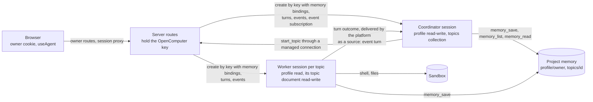

# OpenMuse

[](https://www.repostatus.org/#wip)

Early preview. The layout, the agents and the platform APIs it uses change without notice. Follow the releases to see it grow.

A personal assistant you deploy. One conversation with a coordinator that
answers directly or hands work to topics; each topic is a set of notes plus
a worker with a real computer. OpenComputer Serverless Agents runs the agent
loop, the sandbox, the brokered credentials, the notes (project memory) and
the delivery of each worker's outcome back into the conversation; this
repository is the interface and the delegation rules.


## Run it locally

```sh
git clone https://github.com/diggerhq/openmuse.git && cd openmuse && npm ci
npx opencomputer login
npm run setup -- --origin https://<tunnel host>   # secrets, project link, agents deployed, demo notes seeded
ngrok http --domain=<tunnel host> 3100            # any HTTPS tunnel to port 3100; the agents call back through it
npm run dev
```

Open http://localhost:3100 and sign in with `OPENMUSE_OWNER_SECRET` from `.env.local`.

## Deploy

[](https://deploy.workers.cloudflare.com/?url=https://github.com/diggerhq/openmuse)
[](https://render.com/deploy?repo=https://github.com/diggerhq/openmuse)

- Cloudflare Workers: `npm run deploy:cloudflare`, or the button once the repository is public.
- Docker: `ghcr.io/diggerhq/openmuse`, a volume at `/data`, an https origin in front.
- Fly.io: `fly launch --copy-config --no-deploy`, `fly secrets import < .env.local`, `fly deploy`.
- Render: the button; Render generates the OpenMuse secrets and asks for the OpenComputer key and project id.

Every path is the same two steps around the host's own deploy:

```sh
npm run setup -- --target <cloudflare|docker|fly|render>   # secrets into .env.local, project linked, the host's steps printed
npm run setup -- --origin https://<the app's host>          # agents deployed for that origin, demo notes seeded
```

Details, per host, are under [docs/deploy/](docs/deploy/).

## How it works



- The browser holds an owner cookie and attaches to sessions with `@opencomputer/react` through three proxied routes; it never sees the OpenComputer key.
- The server routes (`src/routes/api/`) hold the key, authenticate the owner, create sessions with their memory bindings and are the only code that talks to the platform.
- The coordinator (`opencomputer/agents/coordinator/`) keeps the one conversation, reads the profile and the topic overview through `useMemory`, saves preferences with `memory_save` and delegates with its one app tool, `start_topic`.
- A worker (`opencomputer/agents/topic-worker/`) runs one topic's tasks with its notes and the profile bound, uses the sandbox when the task needs a computer and saves what it learned with `memory_save`.
- Project memory holds `profile/owner` and one `topics/<id>` document per topic; the owner reads and edits them in the app with revision checks, and the OpenComputer CLI reads the same documents.
- Each worker turn's outcome is delivered by the platform to the coordinator as a turn with `source: "event"` input, which relays it under the topic's title.

What works today, against the real Development environment ([docs/evidence.md](docs/evidence.md)):

- [x] One continuing conversation with the coordinator
- [x] Topics, each with a worker that has a computer
- [x] Notes in project memory, with owner edits and conflict handling
- [x] Worker outcomes delivered back into the conversation by the platform
- [x] Stop
- [ ] A stateless app, once sessions can be found by their key
- [ ] The SDK in place of the hand-written client
- [ ] Sessions that survive a redeploy

The parts that still work around the platform, and what would delete them,
are in [docs/improvements.md](docs/improvements.md).

## Configuration

All configuration comes from the environment; `.env.example` lists every
variable with one line each. Required: `OPENCOMPUTER_API_KEY`,
`OPENCOMPUTER_PROJECT_ID`, `OPENMUSE_OWNER_SECRET`, `OPENMUSE_COOKIE_SECRET`,
`OPENMUSE_AGENT_SECRET`. Everything else has a default.

| Name | Purpose |
| --- | --- |
| `OPENCOMPUTER_API_KEY` | The OpenComputer key, server only |
| `OPENCOMPUTER_PROJECT_ID` | The linked project |
| `OPENCOMPUTER_ENVIRONMENT` | `development` (default) or `production` |
| `OPENCOMPUTER_API_URL` | Default `https://app.opencomputer.dev` |
| `OPENMUSE_OWNER_SECRET` | What the owner types into the login form |
| `OPENMUSE_COOKIE_SECRET` | Signs the session cookie |
| `OPENMUSE_AGENT_SECRET` | The installation secret the agents present to `/api/agent/*`; the app registers it as the project secret, allowed for its origin, on every owner sign-in |
| `OPENMUSE_APP_ORIGIN` | The app's public HTTPS origin; default: the origin of each request |
| `OPENMUSE_INSTALLATION_ID` | Part of every session idempotency key (one installation per project and environment); default `default` |
| `OPENMUSE_COORDINATOR_AGENT`, `OPENMUSE_WORKER_AGENT` | Cloud agent ids; default `openmuse-dev`, `openmuse-dev--topic-worker` |
| `OPENMUSE_STATE_STORE` | The session map: `fs` (default), `kv` (Cloudflare), `memory` |
| `OPENMUSE_STATE_DIR` | For `fs`: default `./.openmuse` (the Docker image sets `/data`) |
| `OPENMUSE_ALLOW_INSECURE_COOKIES` | `1` drops the `Secure` cookie attribute for plain-http localhost |
| `PORT` | For `npm start`; default 3000 |

## Development

`npm run check` runs the typecheck, Biome, the unit tests and the agent
doctor.

`npm run test:e2e` runs the Playwright suite against the real Development
environment. It starts its own server on port 3101 as its own installation
(`e2e`, state under `.openmuse-e2e/`), so its sessions are not yours. It
aborts before any test unless `/api/health` on the server it targets
reports installation `e2e`.

While `npm run dev` runs it writes `.openmuse/transcript.jsonl`: one line
per owner message, reply, topic start, worker outcome and Stop, with
timestamps and session and turn ids. Production builds do not write it.

`npm run deploy:agents` redeploys the agents. Sessions pin the deployment
they started on, so afterwards replace the coordinator from the owner menu
and start a new computer from a topic's Work panel.

## Owner access

The first version uses a generated login secret, not accounts. The login
form posts it to `/api/auth/login`, which compares in constant time, limits
failures to five per client per fifteen minutes, and sets an `HttpOnly`,
`Secure`, `SameSite=Lax` cookie signed with `OPENMUSE_COOKIE_SECRET` that
expires after seven days. Every state-changing route checks the request
origin and a CSRF token bound to the cookie. Secrets never appear in URLs or
browser storage. The OpenComputer key and the agents' installation secret are
separate credentials from the owner's.
