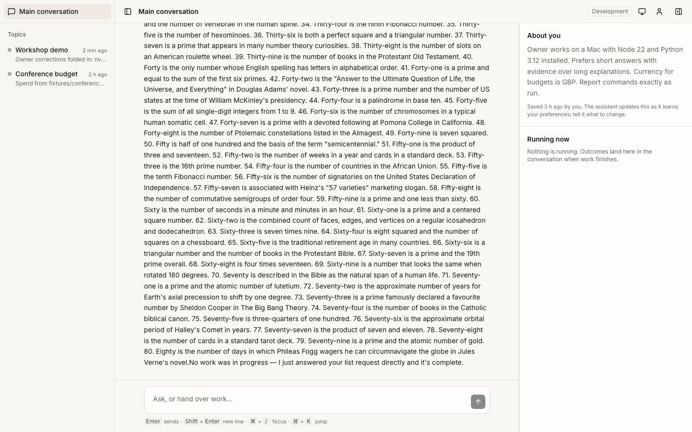
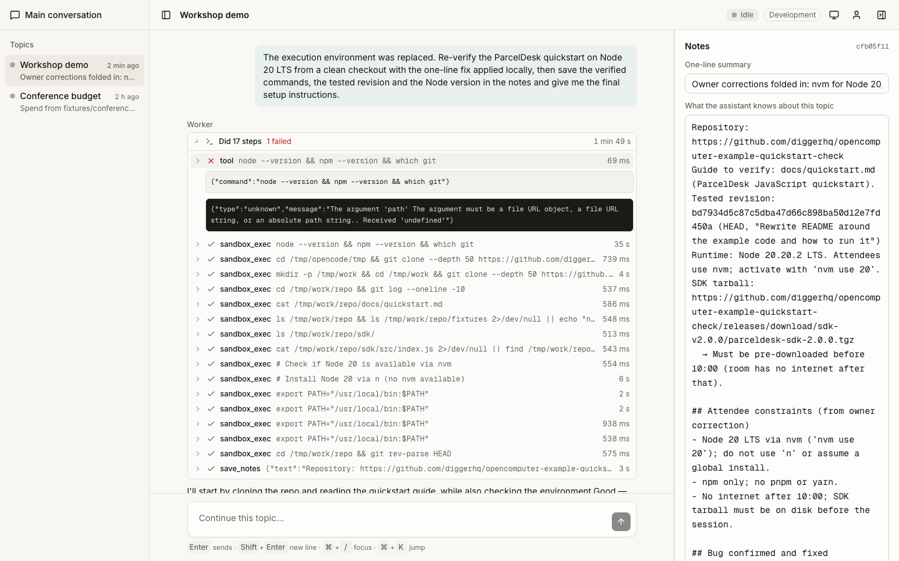
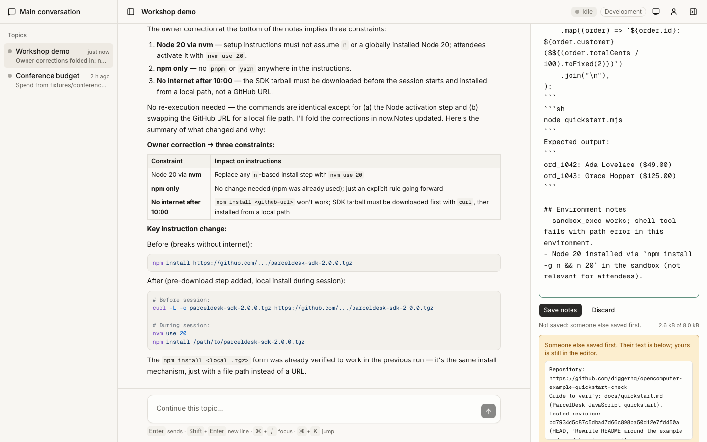
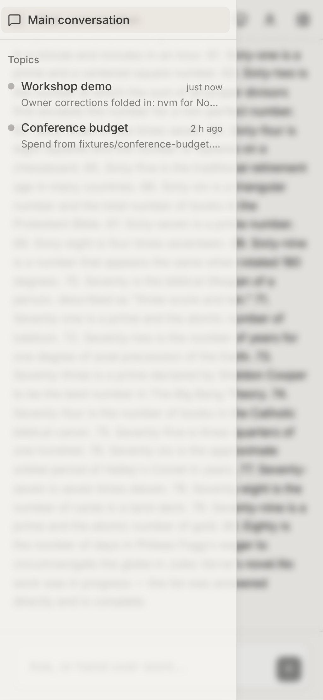

# The OpenMuse interface

One conversation on screen at a time. The sidebar lists where you can go,
the centre is the conversation you picked, the right panel is what belongs
to it. The screenshots below were taken by the end-to-end suite
(`npm run test:e2e`) against the real OpenComputer Development environment,
at 1440x900 and 390x844.

## Information architecture

```
┌ sidebar (240px, collapses to icons, a sheet on phones) ┬ header ────────────────────────────────┐
│ Main conversation  (pinned)                            │ title · status · env · theme · owner · panel │
│ Topics                                                 ├────────────────────────┬───────────────┤
│   ● Workshop demo      2 h ago                         │ the conversation       │ right panel   │
│     one-line summary from the notes                    │   owner messages       │  Main:        │
│   ● Conference budget  2 h ago                         │   assistant replies    │   About you   │
│ Archived (n)  ▸                                        │     with tool rows     │   Running now │
│                                                        │   outcome cards        │  Topic:       │
│                                                        │                        │   Notes       │
│                                                        ├────────────────────────┤   Work        │
│                                                        │ composer  Enter sends  │ (resizable,   │
│                                                        │ Stop while running     │  collapsible) │
└────────────────────────────────────────────────────────┴────────────────────────┴───────────────┘
```

- **Main conversation** (`/`) is the coordinator's chat with the owner. When a
  topic finishes work, the outcome arrives here as a card that links to the
  topic. The panel shows the owner profile the assistant keeps, and which
  topics are busy right now.
- **A topic** (`/topics/<id>`) is that topic's own conversation with its
  worker: the tasks it was given, its replies, and inside each reply the
  computer work it did as compact rows (what ran, how long, the result).
  The composer continues the topic directly. The panel holds the notes
  (editable, with save, unsaved and conflict states, who saved last and
  when, archive) above the current work (status, elapsed time, Stop, the
  link to the session on OpenComputer, start a new computer).
- The URL is the selection; back and forward work. The sidebar and the
  panel remember whether they are open and how wide the panel is.
- Topics are created by the assistant, never by a button. The command
  palette (`Cmd+K`) jumps between conversations and has one secondary
  action, "Start a topic", which puts you in the main conversation with the
  request half-written.
- Status vocabulary, everywhere a topic appears: **Working** (green,
  pulsing), **Needs you** (amber: stopped, or the computer ended), **Idle**
  (grey), **Failed** (red), **Archived** (hollow).

## States

| State | Screenshot |
| --- | --- |
| Main conversation with history, outcome cards and the profile panel | [01-main-conversation](screenshots/01-main-conversation.png) |
| A reply streaming in; Stop has replaced Send | [07-main-streaming](screenshots/07-main-streaming.png) |
| A reply stopped: the interrupted message, the Stop note, the short reply | [08-main-stop](screenshots/08-main-stop.png) |
| A topic: its conversation, notes and work | [02-topic-workshop-demo](screenshots/02-topic-workshop-demo.png) |
| Tool activity rows expanded inside a reply (command, duration, result) | [03-topic-tool-activity](screenshots/03-topic-tool-activity.png) |
| Notes with unsaved changes | [04-notes-unsaved](screenshots/04-notes-unsaved.png) |
| Notes saved, confirmed by the server | [05-notes-saved](screenshots/05-notes-saved.png) |
| Notes conflict: someone else saved first, their text shown, yours kept | [06-notes-conflict](screenshots/06-notes-conflict.png) |
| The event polling dropped: reconnect banner | [09-reconnect-banner](screenshots/09-reconnect-banner.png) |
| Command palette | [10-command-palette](screenshots/10-command-palette.png) |
| Dark mode, main | [11-dark-main](screenshots/11-dark-main.png) |
| Dark mode, topic | [12-dark-topic](screenshots/12-dark-topic.png) |
| Sidebar collapsed to icons | [13-sidebar-collapsed](screenshots/13-sidebar-collapsed.png) |
| Panel collapsed | [14-panel-collapsed](screenshots/14-panel-collapsed.png) |
| Phone: main conversation | [m01-mobile-main](screenshots/m01-mobile-main.png) |
| Phone: the sidebar as a sheet | [m02-mobile-sidebar-sheet](screenshots/m02-mobile-sidebar-sheet.png) |
| Phone: a topic | [m03-mobile-topic](screenshots/m03-mobile-topic.png) |
| Phone: notes and work as a sheet | [m04-mobile-panel-sheet](screenshots/m04-mobile-panel-sheet.png) |









## Honest states

- "Saved" appears only after the server confirmed the write; until then the
  editor says "Unsaved changes" or "Saving…".
- A save that lost the race (the assistant or another tab saved first) is
  refused by the server's compare-and-swap; the panel shows the server's
  text and keeps yours. "Use their text" or "Keep mine, then save over it".
- If the notes change on the server while you are editing, the panel says so
  and offers to load their version; it never replaces your draft.
- A failed reply shows its reason inside the message. A stopped reply says
  "Stopped". A topic whose computer has ended says so above the composer;
  the next message starts a new one from the current notes.
- When event polling fails, a banner says the connection was lost and the
  page keeps trying from the same cursor; nothing is replayed twice.

## Keyboard

`Enter` sends, `Shift+Enter` adds a line, `Cmd+/` focuses the composer from
anywhere, `Cmd+K` opens the palette, `Cmd+B` toggles the sidebar, `Escape`
closes any overlay. Every control is labelled and reachable by keyboard.

## Component tree

```
routes/__root.tsx           html shell: theme provider (system default), tooltips, toasts
routes/_app.tsx             owner guard (server function reads the cookie) → AppShell
  components/app/app-shell.tsx        SidebarProvider + AppSidebar + CommandPalette
    app-sidebar.tsx                   Main pinned, TopicRow (StatusDot, context menu: rename, archive), Archived
    command-palette.tsx               cmdk: conversations, archived, "Start a topic"
  routes/_app.index.tsx     → main-conversation.tsx
  routes/_app.topics.$id    → topic-conversation.tsx
    conversation-frame.tsx            header (SidebarTrigger, title, status, HeaderChrome, panel toggle)
                                      + ResizablePanelGroup(conversation | panel), Sheet on phones
    conversation/use-conversation.ts  useAgent (attach mode) + tool activity + connectivity + clock
    conversation/conversation-view    reconnect banner, MessageList, Composer
      message-list.tsx                sticks to the bottom, pages long histories
      message.tsx                     OwnerMessage, AssistantMessage (ToolActivity + Markdown), OutcomeCard, StopNote
      tool-activity.tsx               "Did N steps · 1 min 49 s" → rows → input and output
      markdown.tsx                    react-markdown + remark-gfm, shiki once the text stops streaming
      composer.tsx                    Enter/Shift+Enter, Send ↔ Stop, disabled reason
    panels/main-panel.tsx             About you (profile notes), Running now
    panels/notes-editor.tsx           reducer in lib/client/notes-machine.ts
    panels/work-panel.tsx             status, elapsed, Stop, OpenComputer link, new computer
```
